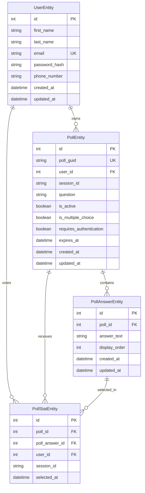

# UpPoll - Modern Polling Platform

A full-stack web application for creating, sharing, and analyzing polls. Built with .NET 8 minimal APIs, React, TypeScript, and PostgreSQL.

## What is UpPoll?

UpPoll is a modern polling platform that allows users to create engaging polls, share them with their audience, and view real-time results. Whether you're gathering feedback, making group decisions, or conducting market research, UpPoll provides the tools you need.

## Features

### For Unauthenticated Users
- **Browse Public Polls**: View and participate in publicly available polls
- **Vote on Polls**: Cast votes on any public poll without needing an account
- **View Results**: See real-time poll results and analytics
- **Responsive Design**: Access polls from any device
- **Session Tracking**: Maintain voting history across browser sessions

### For Authenticated Users
- **Create Polls**: Design custom polls with multiple choice questions
- **Manage Polls**: Edit, delete, or update your existing polls
- **Privacy Controls**: Make polls public or private
- **Dashboard Analytics**: View detailed statistics on poll performance
- **User Management**: Secure account registration and authentication
- **Poll History**: Track all your created polls in one place
- **Poll Migration**: Anonymous polls automatically transferred upon registration

## Architecture

### Backend (.NET 8)
- **Upstart.Api**: Minimal API with endpoint routing and OpenAPI documentation
- **Upstart.Application**: Application layer with service interfaces and business logic
- **Upstart.Domain**: Domain entities and core business models
- **Upstart.Persistence**: Entity Framework Core with PostgreSQL database entities

### Frontend (React + TypeScript)
- **React 18**: Modern React with hooks and functional components
- **TypeScript**: Type-safe development with comprehensive type definitions
- **Tailwind CSS**: Utility-first CSS framework for rapid styling
- **Framer Motion**: Smooth animations and transitions
- **Heroicons**: Beautiful SVG icons
- **Context API**: State management for authentication and global state

### Database Stack
- **PostgreSQL 15**: Primary relational database with Alpine Linux container
- **Entity Framework Core 8**: Object-relational mapping with code-first migrations
- **Connection Pooling**: Optimized database connections for performance
- **Database Health Checks**: Automated health monitoring with Docker Compose

### Infrastructure & DevOps
- **Docker & Docker Compose**: Containerized development and deployment
- **Flyway**: Database migration management and versioning
- **Seq**: Centralized logging and log analysis for development
- **Serilog**: Structured logging with multiple sinks (Console, Seq, File)

## Domain Models

The application uses a clean architecture with well-defined domain entities:



### Key Domain Features
- **Hybrid Authentication**: Supports both authenticated users and anonymous sessions
- **Session Migration**: Anonymous polls automatically transfer to user accounts upon registration
- **Flexible Poll Configuration**: Multiple choice, expiration dates, authentication requirements
- **Vote Tracking**: Comprehensive analytics with user and session-based tracking

## API Documentation

UpPoll provides a comprehensive RESTful API with full OpenAPI 3.0 specification.

### 📚 **Interactive API Documentation**
**🔗 [View API Documentation](https://github.com/crudick/upstart-web-project/blob/main/docs/api-docs.html)**

The API documentation is built with Redoc and provides:
- Complete endpoint reference
- Request/response examples
- Authentication flows
- Schema definitions
- Professional styling

### API Overview

| Endpoint Category | Description | Authentication |
|-------------------|-------------|----------------|
| **Authentication** | User registration, login, profile | JWT + Session |
| **Polls** | CRUD operations for polls | Optional |
| **Poll Answers** | Manage poll options | Mixed |
| **Poll Stats** | Vote submission and analytics | Optional |
| **Users** | User profile management | Required |
| **Security** | CSRF protection | None |

### Key Endpoints

#### Authentication
- `POST /api/auth/register` - Register new user account with optional poll migration
- `POST /api/auth/login` - Authenticate user and receive JWT token
- `GET /api/auth/me` - Get current user information

#### Polls
- `GET /api/polls/public` - Browse all public polls
- `POST /api/polls` - Create poll (authenticated or anonymous)
- `GET /api/polls/guid/{guid}` - Get poll details by GUID
- `PUT /api/polls/{id}` - Update poll (owner only)
- `DELETE /api/polls/{id}` - Delete poll (owner only)

#### Poll Responses
- `POST /api/poll-stats/anonymous` - Submit anonymous vote
- `POST /api/poll-stats` - Submit authenticated vote
- `GET /api/poll-stats/poll/{id}/results` - Get poll results
- `PUT /api/poll-stats/{id}` - Change vote response

#### Session Management
- Anonymous users tracked via `X-Session-ID` header
- Session-based poll ownership and voting
- Automatic poll migration during registration

### OpenAPI Specification
- **Specification File**: [`docs/openapi.yaml`](docs/openapi.yaml)
- **Interactive Documentation**: [`docs/index.html`](docs/index.html)
- **Postman Collection**: Generated from OpenAPI spec

## Quick Start

### Prerequisites
- .NET 8 SDK or later
- Node.js 18+ with npm
- Docker & Docker Compose (recommended)
- PostgreSQL 15+ (if not using Docker)

### Docker Compose Setup (Recommended)

The fastest way to get started is using Docker Compose which handles all dependencies:

```bash
# Clone the repository
git clone <repository-url>
cd upstart-web-project

# Start the complete stack (database, migrations, logging)
docker-compose up --build

# Or start individual services
docker-compose up postgres flyway seq  # Infrastructure only
```

**Services Started:**
- **PostgreSQL**: Database server on `localhost:5432`
- **Flyway**: Automatic database migrations
- **Seq**: Log aggregation on `http://localhost:5341`

### Manual Development Setup

#### 1. Database Setup
```bash
# Start PostgreSQL with Docker
docker-compose up postgres -d

# Or install PostgreSQL locally and create database
createdb UpstartDb
```

#### 2. Backend Setup
```bash
cd backend/Upstart
dotnet restore
dotnet ef database update --project Upstart.Persistence
dotnet run --project Upstart.Api
```
- API runs on: `https://localhost:5166`
- Swagger UI: `https://localhost:5166/swagger`

#### 3. Frontend Setup
```bash
cd frontend
npm install
npm start
```
- Frontend runs on: `http://localhost:3000`

### Environment Variables

Create `.env` files for configuration:

#### Backend (`backend/Upstart/.env`)
```bash
ASPNETCORE_ENVIRONMENT=Development
ConnectionStrings__DefaultConnection="Host=localhost;Database=UpstartDb;Username=postgres;Password=postgres"
JWT__Secret="your-super-secure-jwt-secret-key"
JWT__Issuer="UpPoll"
JWT__Audience="UpPoll-Users"
Seq__ServerUrl="http://localhost:5341"
```

#### Frontend (`frontend/.env`)
```bash
REACT_APP_API_URL=http://localhost:5166
REACT_APP_ENVIRONMENT=development
```

### Running the Application

1. **Complete Stack** (Docker Compose):
   ```bash
   docker-compose up --build
   ```

2. **Development Mode**:
   ```bash
   # Terminal 1: Start backend
   cd backend/Upstart && dotnet run --project Upstart.Api
   
   # Terminal 2: Start frontend
   cd frontend && npm start
   ```

3. **Access the Application**:
   - **Frontend**: http://localhost:3000
   - **API Documentation**: https://localhost:5166/swagger
   - **Interactive API Docs**: Open `docs/index.html` in browser
   - **Seq Logs**: http://localhost:5341

## Project Structure

```
upstart-web-project/
├── backend/
│   └── Upstart/
│       ├── Upstart.Api/              # Web API with minimal endpoints
│       │   ├── Endpoints/            # Feature-based endpoint definitions
│       │   ├── Models/               # API request/response models
│       │   └── Program.cs            # Application entry point
│       ├── Upstart.Application/      # Business logic layer
│       │   ├── Services/             # Application services
│       │   ├── Interfaces/           # Service contracts
│       │   └── Validators/           # FluentValidation rules
│       ├── Upstart.Domain/           # Core domain models
│       │   └── Models/               # Business entities
│       ├── Upstart.Persistence/      # Data access layer
│       │   ├── Data/                 # DbContext and configurations
│       │   ├── Entities/             # Database entities
│       │   ├── Repositories/         # Data repositories
│       │   └── Migrations/           # EF Core migrations
│       └── Upstart.IntegrationTests/ # API integration tests
├── frontend/
│   ├── src/
│   │   ├── components/               # React components
│   │   │   ├── auth/                 # Authentication forms
│   │   │   ├── layout/               # Layout components  
│   │   │   ├── pages/                # Page components
│   │   │   ├── poll/                 # Poll-specific components
│   │   │   └── ui/                   # Reusable UI components
│   │   ├── contexts/                 # React context providers
│   │   ├── services/                 # API client and utilities
│   │   ├── types/                    # TypeScript type definitions
│   │   └── App.tsx                   # Main application component
│   ├── public/
│   │   └── _redirects                # Client-side routing support
│   └── package.json
├── docs/                             # API documentation
│   ├── openapi.yaml                  # OpenAPI 3.0 specification
│   └── index.html                    # Redoc documentation site
├── flyway/upstart/                   # Database migrations
│   ├── flyway.conf                   # Migration configuration
│   └── migrations/                   # SQL migration files
├── docker-compose.yml                # Container orchestration
└── README.md
```

## Database Migrations

This project uses Flyway for database schema management and migrations. Flyway provides version control for your database schema.

### Migration Directory Structure

```
flyway/upstart/
├── flyway.conf              # Local development configuration
├── flyway-docker.conf       # Docker environment configuration
├── migrations/              # SQL migration files
│   └── V1__InitialCreate.sql
└── README.md
```

### Running Migrations

#### Option 1: Docker Compose (Recommended)

The easiest way to run migrations is using Docker Compose, which will automatically:
1. Start PostgreSQL
2. Wait for the database to be healthy
3. Apply all pending migrations
4. Make the database ready for the application

```bash
# Start PostgreSQL and run migrations
docker-compose up postgres flyway

# Or start everything (database, migrations, and logging)
docker-compose up --build
```

#### Option 2: Manual Migration (Local Development)

If you have Flyway installed locally and PostgreSQL running:

```bash
# Navigate to the Flyway configuration directory
cd flyway/upstart

# Run pending migrations
flyway migrate

# Check migration status
flyway info

# View migration history
flyway info
```

### Database Configuration

- **Database**: UpstartDb
- **Host**: localhost (local) / postgres (Docker)
- **Port**: 5432
- **User**: postgres
- **Password**: postgres

## Authentication & Security

### JWT Authentication
- **Token-based authentication** with configurable expiration (default: 24 hours)
- **Secure token generation** using HMAC-SHA256 algorithm
- **Bearer token authorization** for protected endpoints
- **Automatic token validation** middleware with proper error handling

### Session Management
- **Frontend-managed sessions** for anonymous user tracking
- **UUID-based session identifiers** for security and uniqueness
- **Cross-domain session support** with secure cookie configuration
- **Session migration** - anonymous polls transferred to user accounts upon registration

### Password Security
- **BCrypt hashing** with configurable work factor (default: 12)
- **Secure password policies** - minimum 8 characters with complexity requirements
- **No plaintext storage** - passwords immediately hashed upon receipt
- **Salt generation** automatically handled by BCrypt

### API Security
- **CORS configuration** restricting origins to trusted domains
- **Request validation** using FluentValidation with comprehensive rules
- **CSRF protection** via anti-forgery tokens for state-changing operations
- **Input sanitization** preventing injection attacks
- **HTTPS enforcement** in production environments

### Data Protection
- **SQL injection prevention** via Entity Framework parameterized queries
- **XSS protection** through proper output encoding
- **Sensitive data filtering** in logs and error responses
- **Database connection encryption** in transit

### Security Headers
- **Security headers** automatically applied:
  - `X-Content-Type-Options: nosniff`
  - `X-Frame-Options: DENY`
  - `X-XSS-Protection: 1; mode=block`
  - `Strict-Transport-Security` (HTTPS only)

## Logging with Serilog, Seq, and Datadog

This project uses Serilog for structured logging with multiple sinks for different environments:

### Development Logging (Seq)
- **Seq Dashboard**: http://localhost:5341
- **Docker Integration**: Automatically starts with `docker-compose up`
- **Rich Querying**: SQL-like query syntax for log analysis
- **Real-time Monitoring**: Live log streaming and filtering
- **No Authentication**: Simplified setup for local development

### Production Logging (Configurable)
- **File Logging**: Rolling file appender with size and time-based rotation
- **Console Logging**: Structured JSON output for container environments
- **External Services**: Ready for Datadog, Elasticsearch, or Application Insights integration

### Log Structure

The application captures comprehensive telemetry:

#### HTTP Request Logging
```json
{
  "@t": "2023-01-01T12:00:00.000Z",
  "@l": "Information",
  "@m": "HTTP POST /api/polls responded 201 in 45.2ms",
  "RequestHost": "localhost:5166",
  "RequestScheme": "https",
  "RequestPath": "/api/polls",
  "RequestMethod": "POST",
  "StatusCode": 201,
  "Elapsed": 45.2,
  "UserAgent": "Mozilla/5.0...",
  "ClientIP": "192.168.1.1",
  "UserId": 123,
  "RequestId": "0HN2L4M5N6O7P8Q9"
}
```

#### Business Event Logging
```json
{
  "@t": "2023-01-01T12:00:00.000Z",
  "@l": "Information", 
  "@m": "Poll created successfully with ID: 456 and GUID: {PollGuid}",
  "PollId": 456,
  "PollGuid": "550e8400-e29b-41d4-a716-446655440000",
  "UserId": 123,
  "SessionId": "anonymous-session-123",
  "EventType": "PollCreated"
}
```

#### Performance Monitoring
```json
{
  "@t": "2023-01-01T12:00:00.000Z",
  "@l": "Information",
  "@m": "Database operation completed",
  "Operation": "GetPollsByUser", 
  "Duration": 23.5,
  "RecordCount": 15,
  "UserId": 123
}
```

### Starting Seq (Docker)

```bash
# Start just the logging stack
docker-compose up postgres seq

# Or with the full application
docker-compose up --build
```

## Deployment

### Production Considerations

#### Environment Configuration
- **Environment-specific settings** via `appsettings.{Environment}.json`
- **Secret management** using Azure Key Vault, AWS Secrets Manager, or Docker secrets
- **Connection string security** with encrypted storage and rotation
- **Feature flags** for gradual rollout and A/B testing

#### Security Hardening
- **HTTPS enforcement** with HSTS headers and secure redirects  
- **Security headers** automatically applied via middleware
- **API versioning** for backward compatibility and deprecation management
- **Input validation** with comprehensive sanitization and size limits
- **Authentication hardening** with token rotation and refresh mechanisms

#### Performance Optimization
- **Response caching** for frequently accessed public polls
- **Database connection pooling** with optimized pool sizes
- **Static file optimization** with compression and CDN integration
- **Response compression** (Gzip/Brotli) for API responses
- **Database indexing** optimized for query patterns

#### Monitoring & Observability
- **Health checks** for database, external dependencies, and application health
- **Application Performance Monitoring** ready for integration
- **Structured logging** with correlation IDs for request tracing
- **Metrics collection** for business and technical KPIs
- **Error tracking** with detailed stack traces and context

#### Scalability
- **Horizontal scaling** support with stateless application design
- **Load balancer compatibility** with proper health check endpoints
- **Database scaling** considerations with read replicas and connection pooling
- **Caching strategy** with Redis or in-memory caching options

### Docker Production Deployment

The application includes optimized Dockerfiles for both backend and frontend services.

#### Backend Container
```bash
# Build from the backend directory
cd backend/Upstart
docker build -t uppoll-api .
docker run -p 5000:5000 -e ConnectionStrings__DefaultConnection="your-db-connection" uppoll-api
```

The backend Dockerfile uses multi-stage builds:
- Build stage: .NET 8 SDK for compilation
- Runtime stage: .NET 8 ASP.NET runtime (smaller footprint)
- Exposes port 5000

#### Frontend Container  
```bash
# Build from the frontend directory
cd frontend
docker build -t uppoll-frontend --build-arg REACT_APP_API_URL=https://your-api-url .
docker run -p 80:80 uppoll-frontend
```

The frontend Dockerfile:
- Build stage: Node.js 18 Alpine for React compilation
- Runtime stage: Nginx Alpine for static file serving
- Accepts `REACT_APP_API_URL` build argument
- Serves on port 80

#### Container Orchestration
- **Kubernetes manifests** for production orchestration
- **Health checks** with proper startup, readiness, and liveness probes
- **Resource limits** and requests for optimal resource allocation
- **ConfigMaps and Secrets** for secure configuration management
- **Ingress configuration** for SSL termination and routing

### Cloud Deployment Options

#### Platform-as-a-Service
- **Azure App Service** with integrated SQL Database
- **AWS Elastic Beanstalk** with RDS PostgreSQL
- **Google Cloud Run** with Cloud SQL
- **Render.com** with managed PostgreSQL (current deployment)

#### Infrastructure-as-a-Service  
- **Azure Container Instances** with Azure Database for PostgreSQL
- **AWS ECS/Fargate** with RDS
- **Google Cloud Run** with managed services
- **DigitalOcean App Platform** with managed database

#### Container Orchestration
- **Azure Kubernetes Service (AKS)** for enterprise deployments
- **Amazon EKS** with managed PostgreSQL
- **Google GKE** with Cloud SQL integration
- **Self-managed Kubernetes** with Helm charts

### CI/CD Pipeline

#### Recommended Pipeline Stages
1. **Code Quality**: Linting, formatting, security scanning
2. **Testing**: Unit tests, integration tests, end-to-end tests  
3. **Building**: Multi-stage Docker builds with layer caching
4. **Security**: Vulnerability scanning, dependency auditing
5. **Deployment**: Blue-green or rolling deployments
6. **Monitoring**: Post-deployment health checks and rollback capabilities

## Contributing

1. Fork the repository
2. Create a feature branch (`git checkout -b feature/amazing-feature`)
3. Commit your changes (`git commit -m 'Add some amazing feature'`)
4. Push to the branch (`git push origin feature/amazing-feature`)
5. Open a Pull Request

### Development Guidelines
- Follow existing code style and conventions
- Add tests for new features and bug fixes
- Update documentation for API changes
- Ensure all tests pass before submitting PR
- Keep commits focused and well-documented

## License

This project is licensed under the MIT License - see the LICENSE file for details.